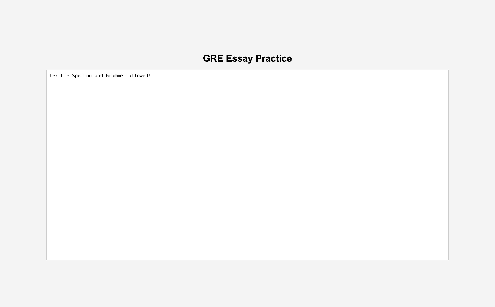

# How To Use #
Clone the repo and run the following command in the terminal. 

``` git clone git@github.com:ollieellis/GRE_writing_task_text_edditor.git ```

then open up the file location in your browser

If the above does not make sense; open the "gre_ide.html" file; go somewhere in your files and make the file; copy and paste it in. then get the full file path of the file with the same name; ie. "C:\Users\ollie\Documents\someLocation\gre_ide.html" and paste that file path into your search bar on your browser.